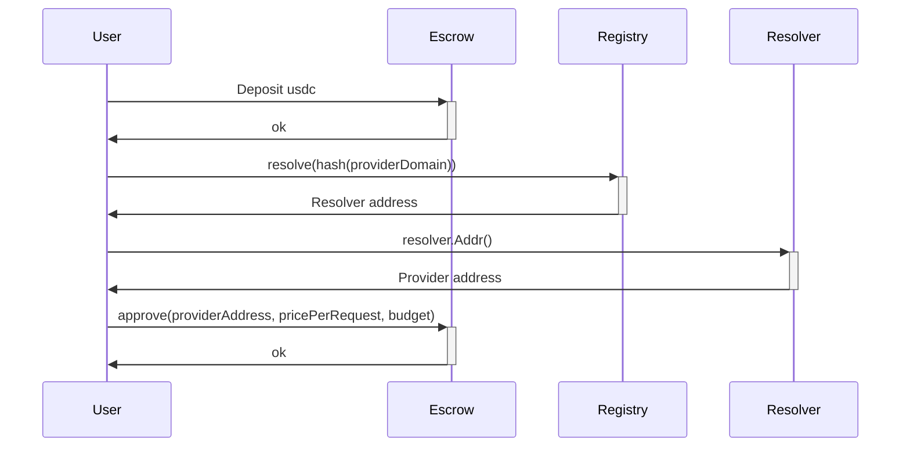
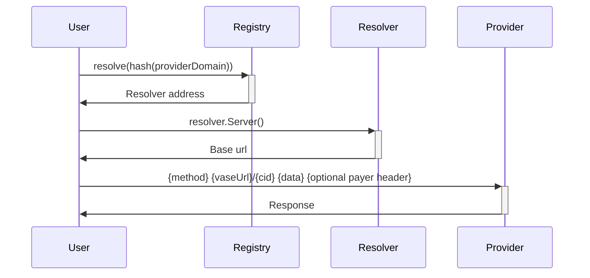
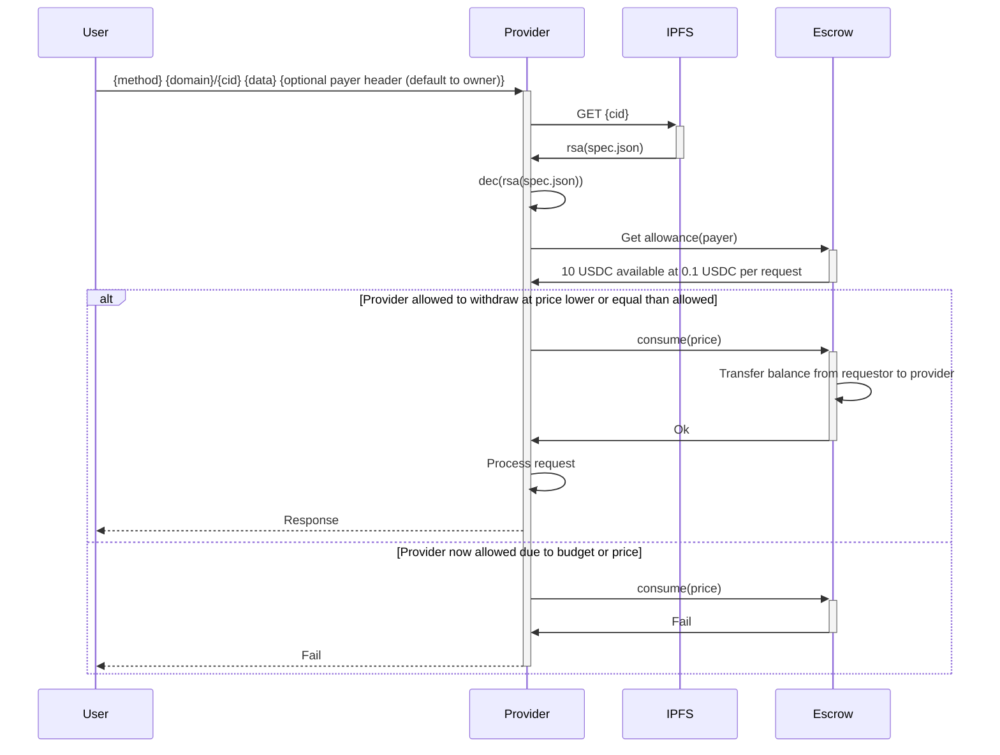
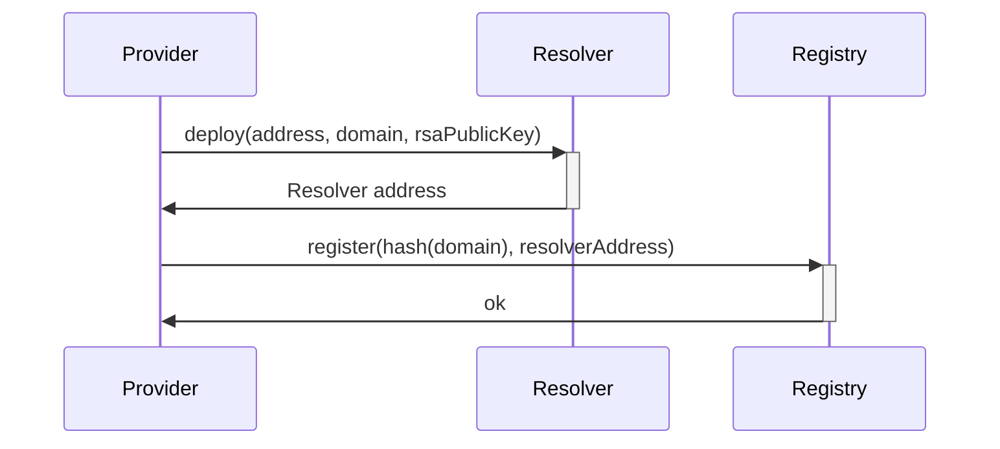
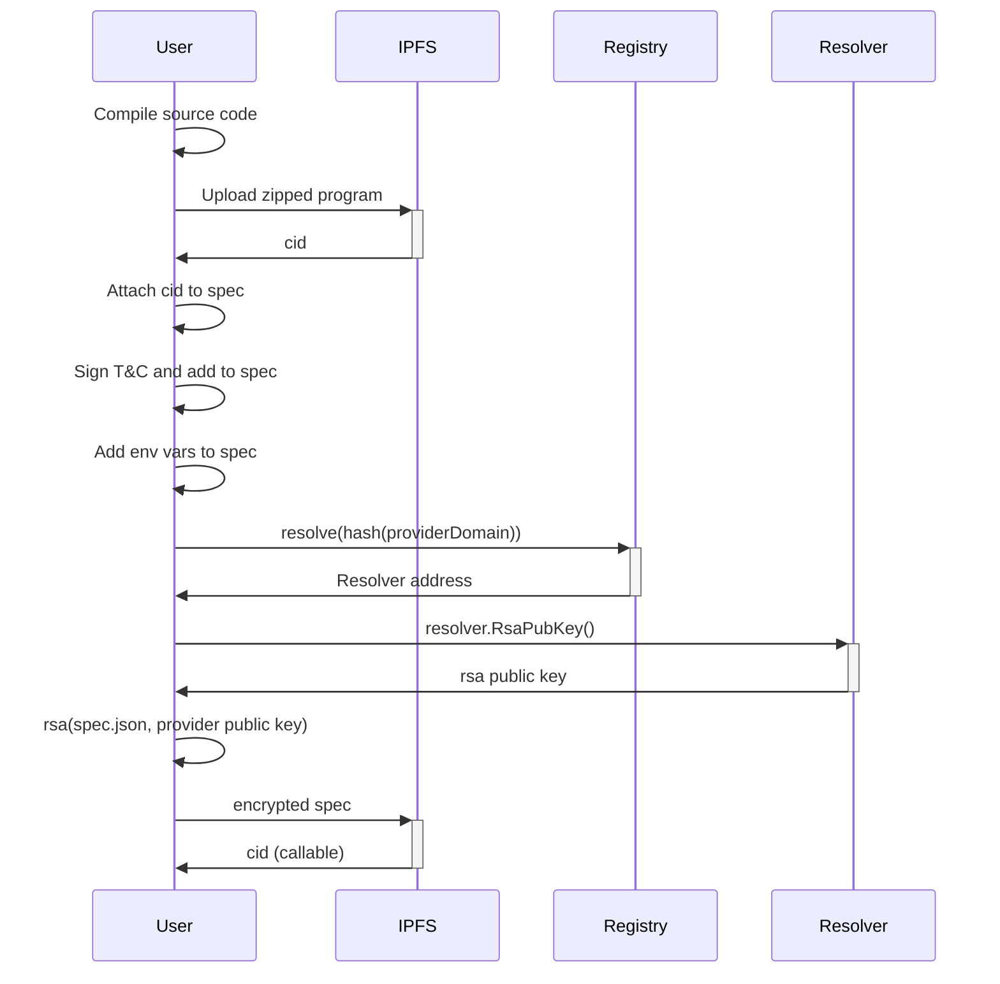
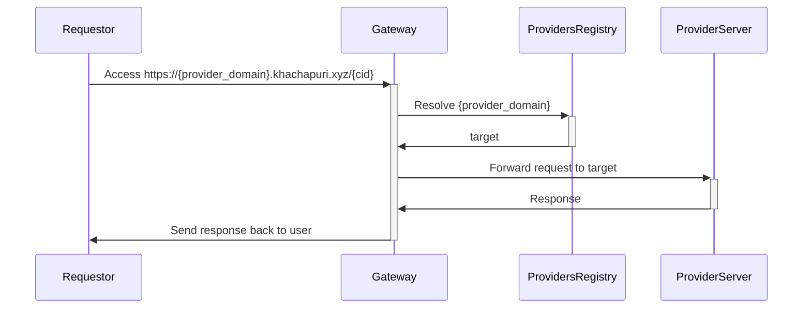
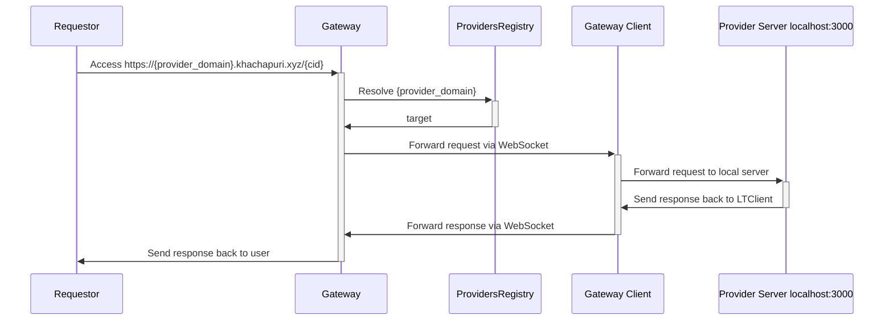

# Khachapuri - Decentralized IPFS based compute

Imagine AWS lambdas for IPFS compute, host your code in IPFS and make it worldwide available. You have a server, offer your compute power and get paid, you want cheap decentralized serverless functions, host your code, protect your secrets and pay with usdc.

Why khachapuri? It's just mindbogglingly delicious and palta was already taken.

## Structure

## Design

Programs are binaries with curl interface. Imagine that, call a endpoint with curl but instead of processing the response elsewhere we process it right there, curl is the interface.

###  Allow provider spending

###  Make request to provider

The domain can also resolved by the gateway and that will be the preference

###  Provider program execution

###  Register provider

###  Deployment

### Gateway

We want to:
- Create an easy and secure entry point for the deployments.
- Allow for easy deployments
- Enable a reputation system
- Enable smart routing of requests

#### Reverse proxy

{provider}.khachapuri.xyz:  

Resolves {provider} and acts a universal entry safe point to providers

#### Local tunneling

Allow everybody to easily provide compute to the network. 

## TODO

TODO: add to contract trial credits giveaway. Users cannot withdraw, neither providers, just provider assigns some free credits to some user for trial
TODO: reputation system
TODO: Timeout docker running 15 secs or so
TODO: Allow unencrypted deployments, anybody can run. Cool also if there can be more than one runner
TODO: option to encrypt deployment at rest
