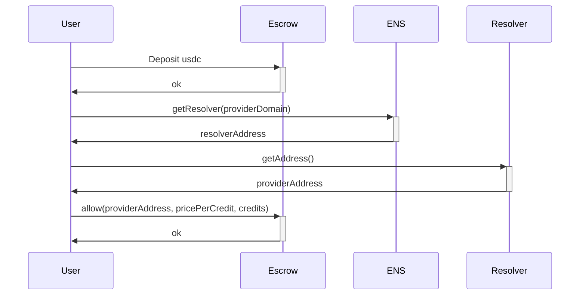
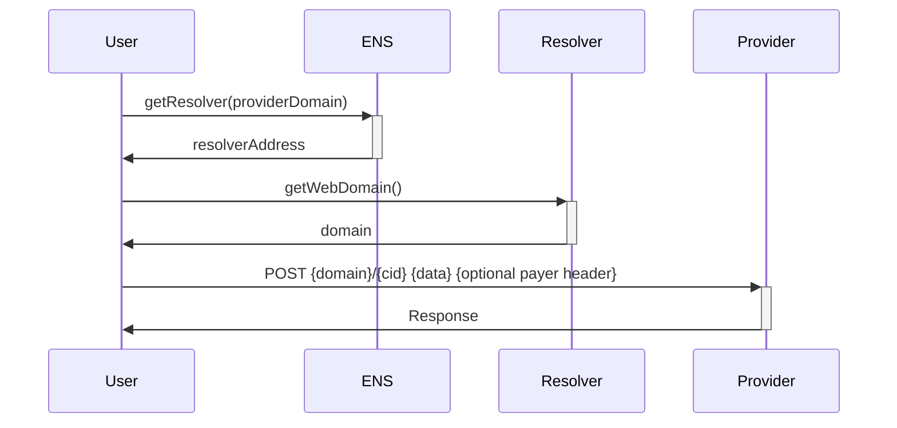
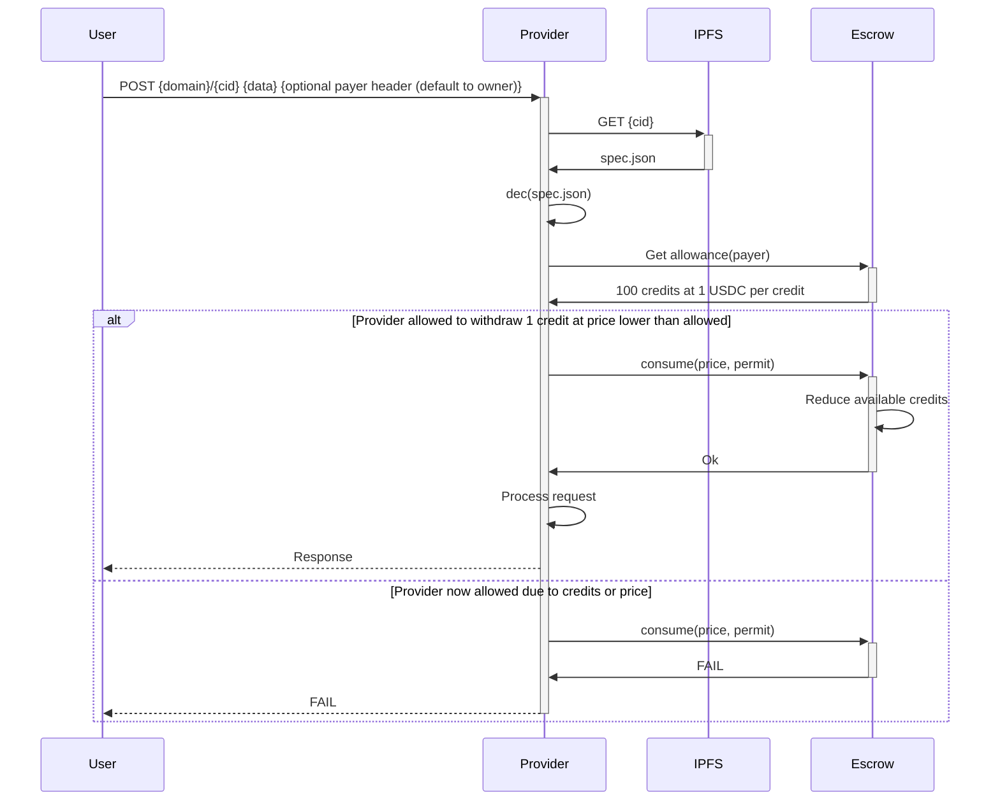
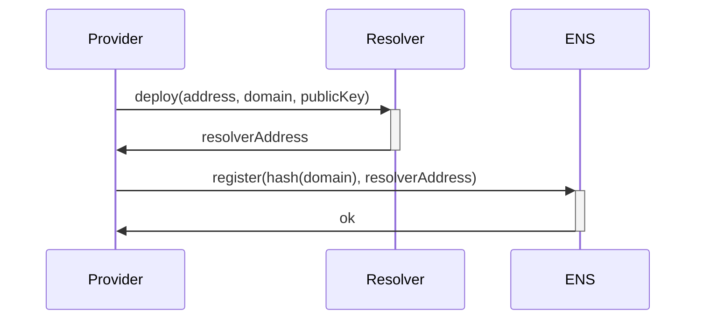
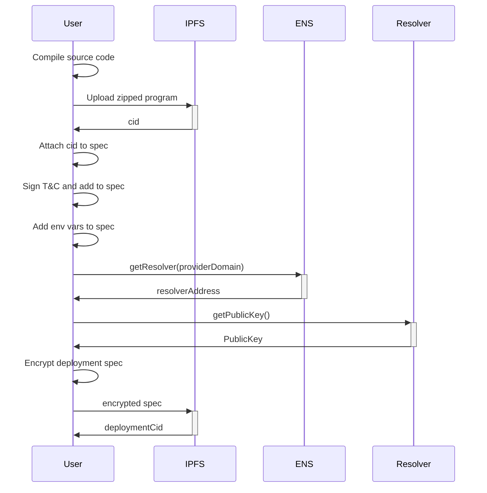

# Khachapuri - Decentralized IPFS based compute

Imagine AWS lambdas for IPFS compute, host your code in IPFS and make it worldwide available. You have a server, offer your compute power and get paid, you want cheap decentralized serverless functions, host your code, protect your secrets and pay with usdc.

Why khachapuri? It's just mindbogglingly delicious and palta was already taken.

## Design

Programs are binaries with curl interface. Imagine that, call a endpoint with curl but instead of processing the response elsewhere we process it right there, curl is the interface.

###  Allow provider spending

###  Make request to provider

###  Provider program execution

###  Register provider

###  Deployment

## TODOS

TODO: Timeout docker running 15 secs or so
TODO: Pass method, headers and so on as args. Also allow more control on communication between processes so it works like a full server
TODO: Create library for hashing domains (https://github.com/Arachnid/eth-ens-namehash/blob/master/index.js) maybe even assign all to owner and owner manages it (https://github.com/ensdomains/ens-contracts/blob/8e8cf71bc50fb1a5055dcf3d523d2ed54e725d28/contracts/registry/ENSRegistry.sol#L29)