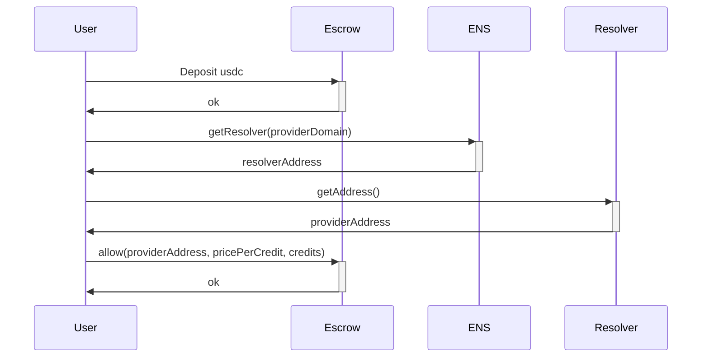
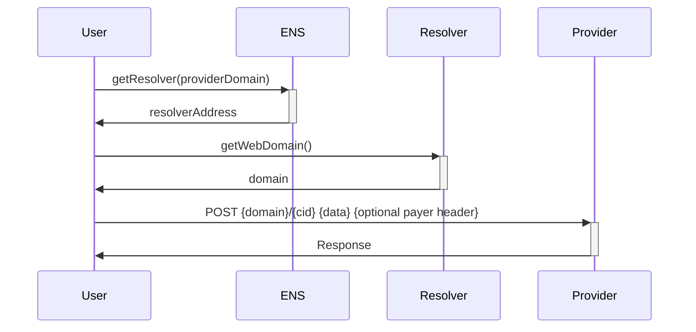
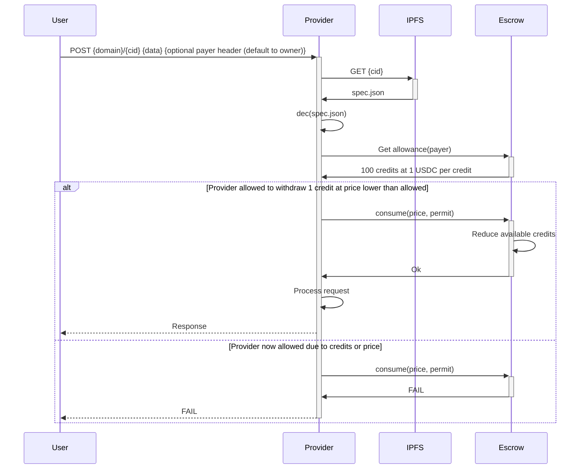
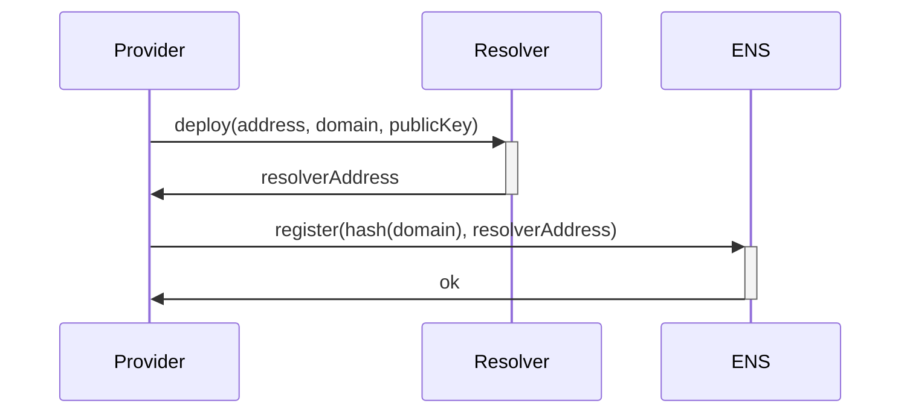
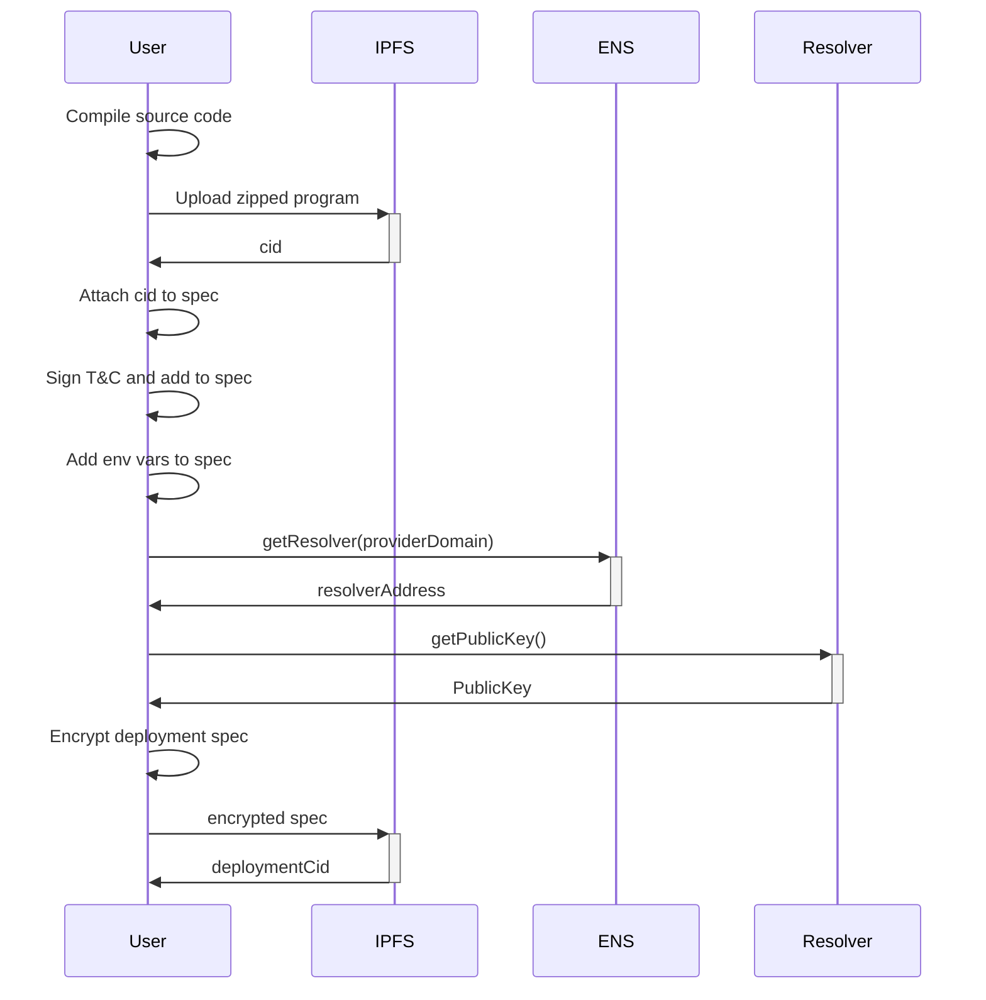

TODO: Timeout docker running 15 secs or so
TODO: Pass method, headers and so on as args. Also allow more control on communication between processes so it works like a full server

## Design

Programs are binaries with curl interface. Imagine that, call a endpoint with curl but instead of processing the response elsewhere we process it right there, curl is the interface.


###  Allow provider spending



###  Make request to provider



###  Provider program execution



###  Register provider



###  Deployment



## Contracts

### Credits escrow

```solidity

interface Escrow {
    // transfer usdc to escrow
    deposit(usdc amount) 

    withdraw()

    consume(price, request_hash, permit) onlyProvider -> (permit contains price, request hash)

    allowance(provider, budget) -> user allows provider to consume from his credits
}

```


### ENS registry

```solidity
map provider_domain -> resolver

register(domain, resolver)

getResolver(domain) -> resolver
```

### ENS resolver

```solidity
address()
public_key()
domain()
```

