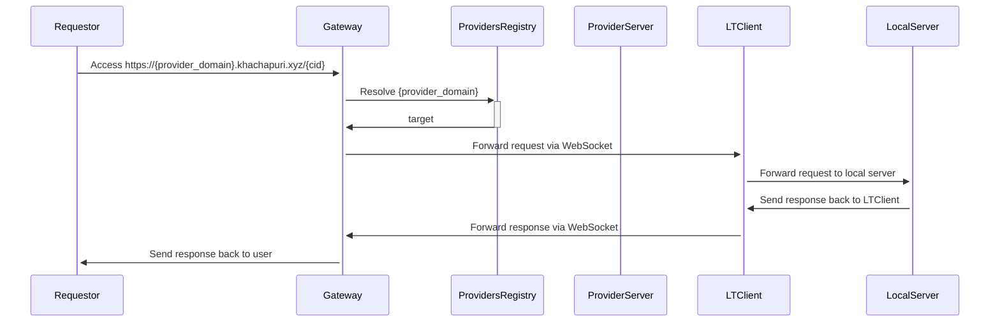
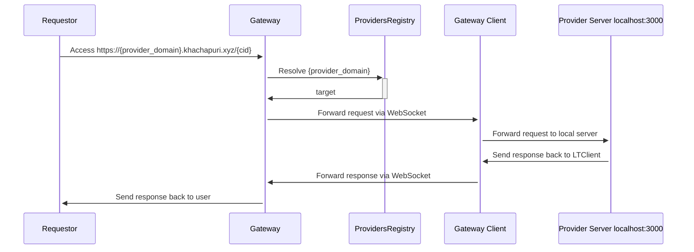

# Khachapuri - Decentralized IPFS based compute

Imagine AWS lambdas for IPFS compute, host your code in IPFS and make it worldwide available. You have a server, offer your compute power and get paid, you want cheap decentralized serverless functions, host your code, protect your secrets and pay with usdc.

Why khachapuri? It's just mindbogglingly delicious and palta was already taken.

## Structure

- `cli` -> Create deployments and interact with contracts, allow providers, register providers, check balances, deposit in escrow
- `contracts` -> Contracts for escrow contract and registry
- `provider` -> Provider server, process requests
- `gateway` -> Reverse proxy / localtunnel
- `shared` -> Go shared resources
    - Contracts
    - ECDSA and RSA utilities
    - Registry domain hashing

## Design

Programs are binaries with curl interface. Imagine that, call a endpoint with curl but instead of processing the response elsewhere we process it right there, curl is the interface.

###  Allow provider spending

###  Make request to provider

###  Provider program execution

###  Register provider

###  Deployment

### Gateway

We want to:
- Create an easy entry point for the 

#### Reverse proxy

{provider}.khachapuri.xyz:  

Resolves {provider} and acts a universal entry safe point to providers

#### Local tunneling

To allow everybody to provide compute to the network we would host a tunneling service like localtunnel withing the gateway. 

## TODO

TODO: Timeout docker running 15 secs or so
TODO: Allow unencrypted deployments, anybody can run. Cool also if there can be more than one runner
TODO: Create library for hashing domains (https://github.com/Arachnid/eth-ens-namehash/blob/master/index.js) maybe even assign all to owner and owner manages it (https://github.com/ensdomains/ens-contracts/blob/8e8cf71bc50fb1a5055dcf3d523d2ed54e725d28/contracts/registry/ENSRegistry.sol#L29)